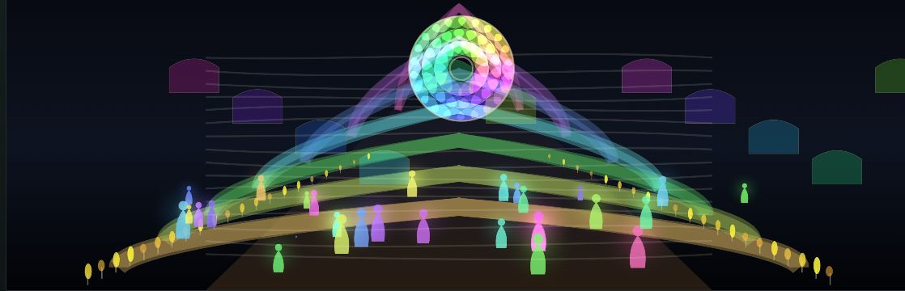
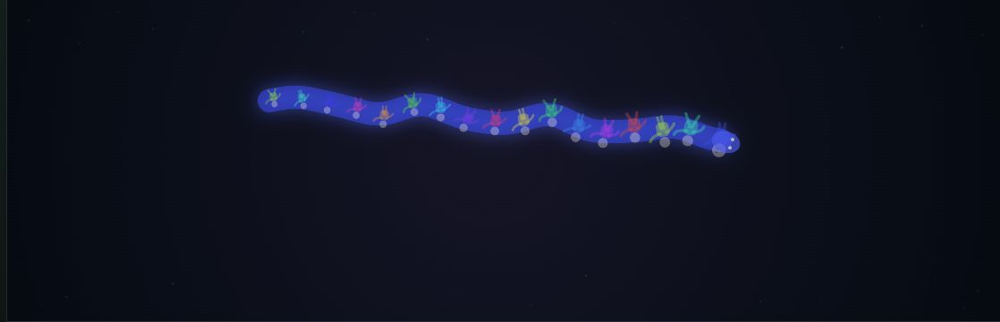
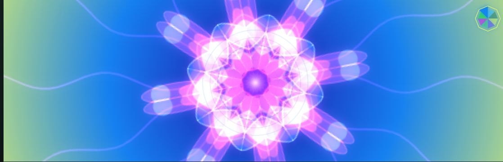
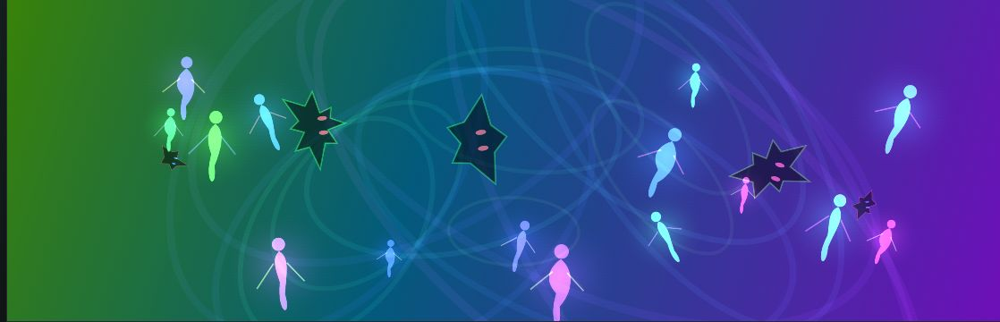
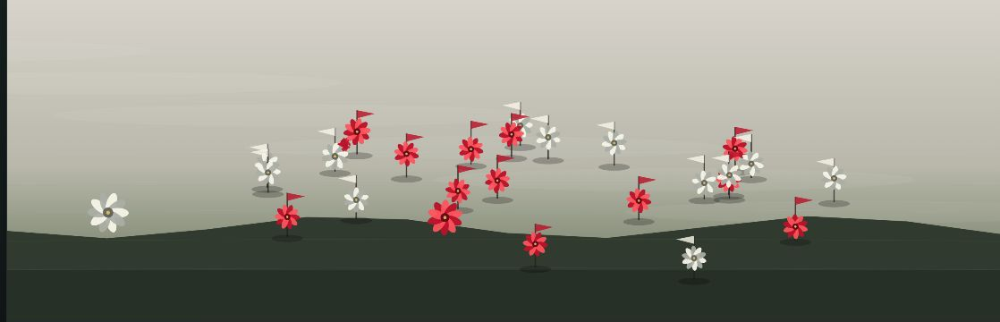
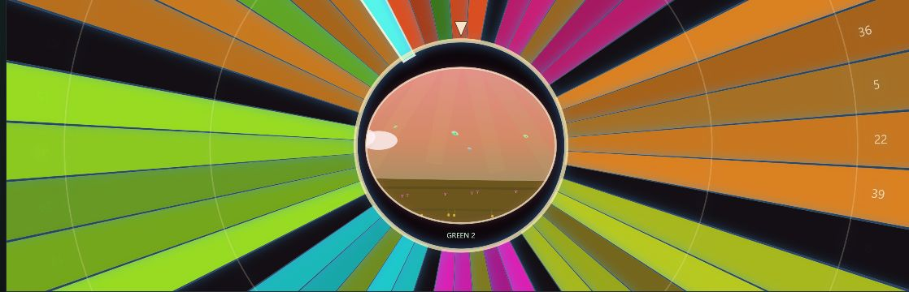
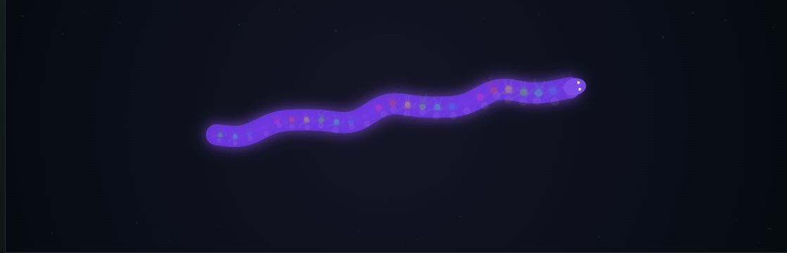
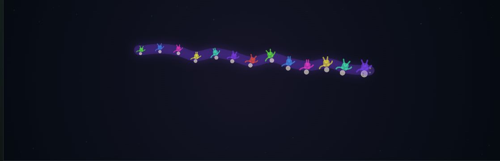
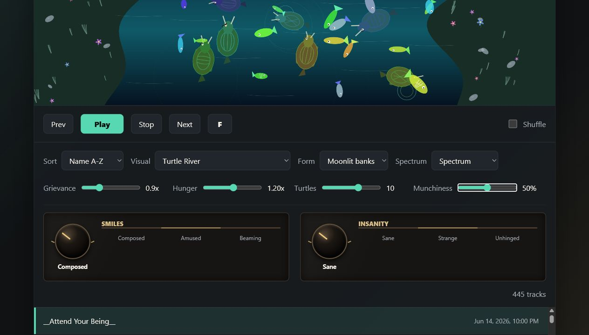
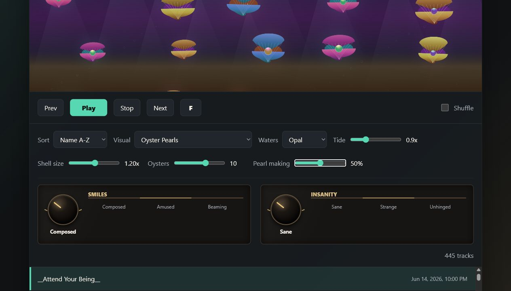

# 32 Visualisations

**Mental. Saturation. Overstimulation.**

32 Visualisations is a local-first WAV player and music-reactive cabinet of
curiosities. It turns frequency, pressure, rhythm and mood into fireworks,
cathedrals, predatory wildlife, romantic flora, questionable hosiery and one
Chimaera of Snake and Conga-line.

The number is fixed. Thirty-two is binary, balanced, mellow in its intonation
and just faintly occult. New visualisations may therefore require ceremonial
retirement of old ones.

## A glimpse



| | |
|---|---|
| <br>**Chimaera of Snake and Conga-line** | <br>**Kaleidoscope: Midnight rabbit** |
| <br>**Hypnotic Flight: Prismatic fever** | <br>**War of the Roses: Crown melee** |



**Bob Ross Garden**

### Snake / Conga transition

| Snake | Conga-line |
|---|---|
|  |  |

### Controls with opinions

| | |
|---|---|
| <br>**Grievance. Hunger. Munchiness.** | <br>**Tide. Shell size. Pearl making.** |

## The proposition

- Play a directory of WAV files in order or on shuffle.
- Sort the library by name or date.
- Move between 32 distinct canvas visualisations.
- Shape each visualisation with contextual controls whose meanings change with
  the scene: Meander, Belligerence, Pearl making, Munchiness, Mischief and more.
- Add global **Smiles** and **Insanity** using reassuringly physical Bakelite
  expression dials.
- Enter a distraction-free fullscreen stage.
- Keep the music and its metadata on the local machine.

There is no framework, build pipeline or cloud service between the music and
the spectacle. The application is HTML, CSS, JavaScript and a small Node.js
server.

## The 32

| | | | |
|---|---|---|---|
| Equaliser | Fireworks | Pac Dance | Branch Hands |
| Swamp Bubbles | Arrow Storm | Cephalopod Mind | Disco Jive |
| Glitter Fall | Butterfly Host | Knife Thunk | Octopus Occlusion |
| Lizard Louche | Goddess Kisses | Climbing Garden | Tipu's Tiger |
| Mandelbrot Set | Eyes | Lightning | Asteroids |
| Interzone Oracles | Sunflower Smiles | War of the Roses | Turtle River |
| Cathedral Organism | Hypnotic Flight | Kaleidoscope | Bob Ross Garden |
| Oil Slide | Oyster Pearls | Lingerie | Chimaera of Snake and Conga-line |

Some are contemplative. Some are playable. Some should possibly be discussed
with a responsible adult.

## Running locally

### Requirements

- A current version of Node.js
- A directory containing `.wav` files
- A modern browser

### Start

Set the library directory and run the server from the repository root.

PowerShell:

```powershell
$env:WAVE_DECK_LIBRARY = "D:\Music\WAV"
node server.js
```

macOS or Linux:

```bash
WAVE_DECK_LIBRARY="/path/to/wav-library" node server.js
```

Then open [http://127.0.0.1:4173/](http://127.0.0.1:4173/).

The **Open folder** control can also select a different local directory in
browsers that support the File System Access API.

## Controls

- `Play`, `Stop`, `Prev`, `Next` and `Shuffle` handle the library.
- `Up` and `Down` move through visualisations.
- `Left` and `Right` move through tracks.
- `F` or `F4` toggles the visual stage.
- `W`, `A`, `S` and `D` adjust the global expression dials and operate certain
  interactive scenes.
- Each visualisation supplies its own labelled controls for form, colour,
  speed, scale, population and temperament.

## Status

This project is still under active development, so any hallucinations you
experience may not be entirely your own fault this time.

If you enjoyed this, why not gain merit in this life by buying this holy man a
pint of mead or ale, according to your purse?

## Direction

**Artistic Director:** AndyJMyers  
**Engineering:** developed in collaboration with OpenAI Codex

The governing principle is simple: saturation without sludge, overstimulation
without indifference, and enough mental movement to make a waveform feel
briefly alive.
