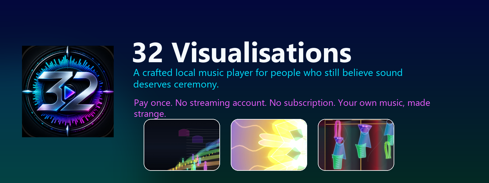
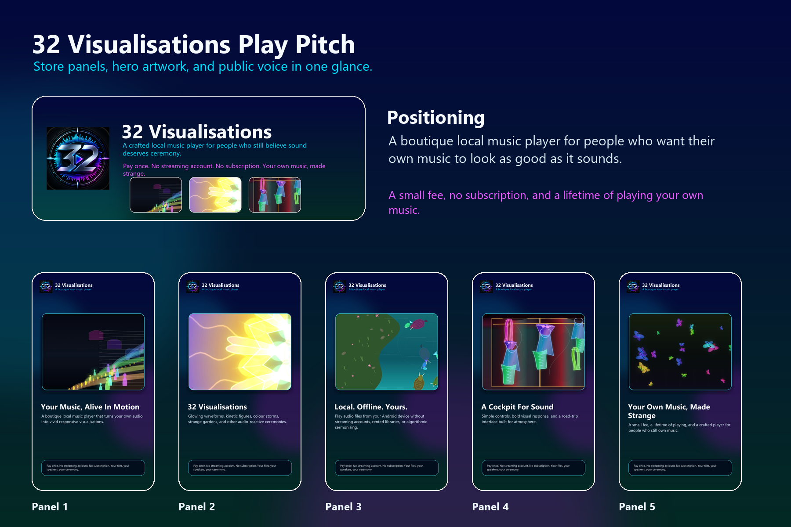
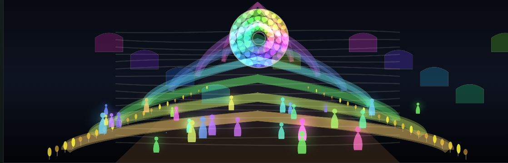
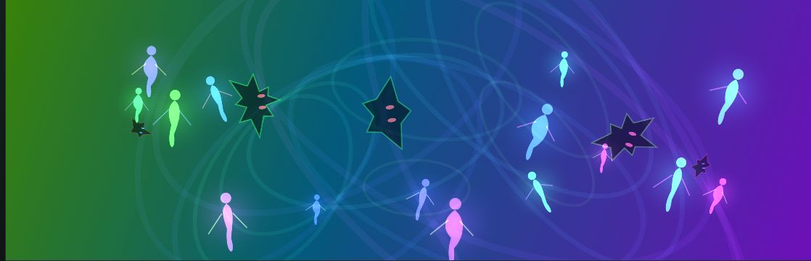
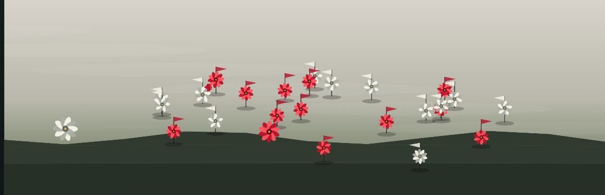
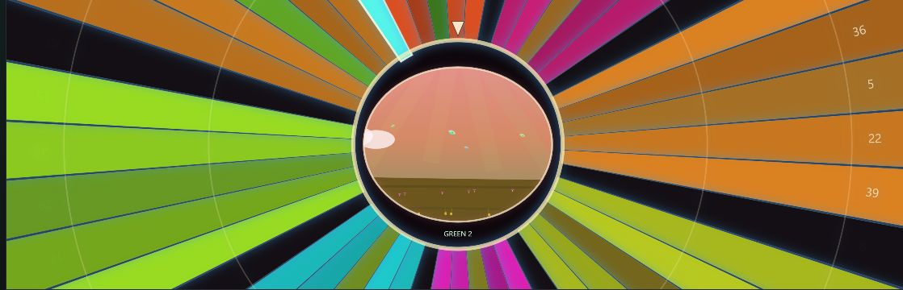
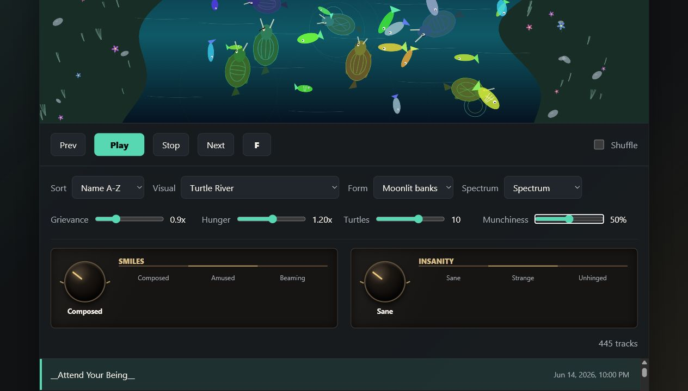
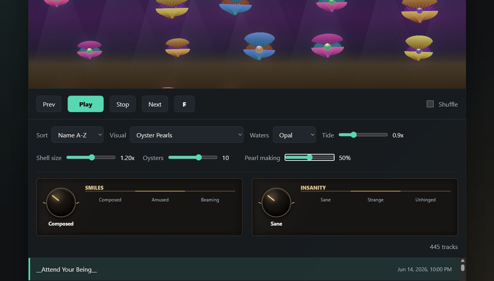

# 32 Visualisations

**Own your music. Pay once. Watch it come alive.**



32 Visualisations is a boutique local music player and audio-reactive visualisation cabinet for people who still believe their own music collection matters.

It began as a desktop local music player with a taste for **Mental. Saturation. Overstimulation.** It has grown into an Android road-trip music player built for local files, big stereos, strange colour, and cockpit-simple controls.

No streaming account. No subscription. No rented library quietly disappearing when the bill stops. Just your files, your device, your speakers, and thirty-two vivid ways to make sound visible.

The app also includes a small original three-track sample suite so a fresh install has something to play immediately. It is a showcase, not an exhaustive back catalogue.

## The Story

Streaming made music convenient, but it also made listening feel rented, flattened, and strangely disposable. 32 Visualisations goes the other way.

You choose a folder of local audio files. The app plays them. The screen becomes part equaliser, part theatre, part questionable private cinema for waveforms. Some visualisations are elegant. Some are ridiculous. Some behave as if the music has been left alone with a chemistry set.

The guiding idea is simple:

> Add lightness. Add horsepower. Remove nonsense.

That means few controls, large targets, no account ceremony, no fiddly in-car settings, and enough visual excess to make a track feel like an event.

## Engineering Log


More attributed engineering log entries live in [docs/engineering-log/](docs/engineering-log/).

## What It Does

- Plays local audio files from a folder, including `.wav`, `.mp3`, `.m4a`, `.aac`, `.flac`, `.ogg`, and `.opus`.
- Includes a bundled three-song original sample suite for first launch and demonstration.
- Runs as a desktop browser app or an offline-first Android WebView app.
- Provides a fixed set of **32** audio-reactive visualisations.
- Offers car-style Android controls for play/pause, previous/next track, next visualisation, shuffle, `Alchemy`, and `Speed`.
- Uses `Alchemy` to apply artistically chosen visual settings.
- Uses `Speed` to cycle visual agitation through five colour-coded steps.
- Keeps your music local.
- Works without internet connectivity once installed.

The number is fixed. Thirty-two is binary, balanced, mellow in its intonation and just faintly occult. New visualisations may therefore require ceremonial retirement of old ones.

## A Glimpse





| | |
|---|---|
| <br>**Chimaera of Snake and Conga-line** | <br>**Kaleidoscope: Midnight rabbit** |
| <br>**Hypnotic Flight: Prismatic fever** | <br>**War of the Roses: Crown melee** |



**Bob Ross Garden**

### Snake / Conga Transition

| Snake | Conga-line |
|---|---|
|  |  |

### Controls With Opinions

| | |
|---|---|
| <br>**Grievance. Hunger. Munchiness.** | <br>**Tide. Shell size. Pearl making.** |

## The 32

| | | | |
|---|---|---|---|
| Equaliser | Fireworks | Pac Dance | Branch Hands |
| Swamp Bubbles | Arrow Storm | Cephalopod Mind | Disco Jive |
| Glitter Fall | Butterfly Host | Knife Thunk | Octopus Occlusion |
| Lizard Louche | Goddess Kisses | Climbing Garden | Tipu's Tiger |
| Mandelbrot Set | Eyes | Lightning | Asteroids |
| Interzone Oracles | Sunflower Smiles | War of the Roses | Turtle River |
| Cathedral Organism | Hypnotic Flight | Kaleidoscope | Bob Ross Garden |
| Oil Slide | Oyster Pearls | Lingerie | Chimaera of Snake and Conga-line |

Some are contemplative. Some are playable. Some should possibly be discussed with a responsible adult.

## Android Road-Trip Player

The Android app is the mobile-first version of the same visualisation world. It is designed for in-car use: portrait layout, large controls at the bottom, familiar transport actions, and a little visual theatre when buttons are pressed.

The app opens with the bundled three-track sample suite, then uses Android's folder picker to choose a local music folder when you want the full road-trip library. Once installed and pointed at music, it is intended to work offline. Bluetooth routing is handled by Android itself.

Current Play preparation lives in:

- [Play Console answers](docs/play-store/PLAY_CONSOLE_ANSWERS.md)
- [Tester QA checklist](docs/play-store/TESTER_QA_CHECKLIST.md)
- [Privacy policy](docs/play-store/PRIVACY_POLICY.md)
- [Play pitch pack](docs/play-store/pitch/PLAY_PITCH.md)

Public privacy policy:

[32 Visualisations Privacy Policy](https://andyjmyers.substack.com/p/32-visualisations-privacy-policy)

## Testing

We are preparing for Google Play testing. The tester process is deliberately lightweight: install through a Play test link, choose a music folder, play a few tracks, try the main controls, and report anything strange.

The human-friendly test plan is here:

[Tester QA Checklist](docs/play-store/TESTER_QA_CHECKLIST.md)

Google may require 14 continuous days of closed testing for new personal developer accounts. That does not mean heavy testing every day. It means a real group of testers opting in, installing, and giving the app a fair try while the release path matures.

Automated system tests can be run from the repository root with:

```powershell
node tools/system-test.js
```

The system tests start a temporary local server against the bundled sample suite, then verify the web app loads, the sample tracks are discovered, ranged audio is served, and unsafe audio requests are blocked.

After a release build, run:

```powershell
powershell -ExecutionPolicy Bypass -File .\tools\verify-android-release.ps1
```

The release build script also runs this verification after Gradle finishes.

## Running Locally

### Requirements

- A current version of Node.js
- A directory containing supported audio files
- A modern browser

### Start

Set the library directory and run the server from the repository root.

PowerShell:

```powershell
$env:WAVE_DECK_LIBRARY = "D:\Music\Road Trip"
node server.js
```

macOS or Linux:

```bash
WAVE_DECK_LIBRARY="/path/to/music-library" node server.js
```

Then open [http://127.0.0.1:4173/](http://127.0.0.1:4173/).

If `WAVE_DECK_LIBRARY` is not set, the local server uses the bundled `sample-music/` showcase suite.

The **Open folder** control can also select a different local directory in browsers that support the File System Access API.

### Run With Codex

Clone the repository, open its folder in the [Codex app](https://developers.openai.com/codex/app), and select **Local**. Then give Codex the location of your music library:

```text
Start 32 Visualisations using my music library at "D:\Music\Road Trip". Keep the
server running at http://127.0.0.1:4173/, verify that the page and track
library load, and give me the link.
```

Use the equivalent `/path/to/music-library` on macOS or Linux. Codex will set the library environment variable, start the local Node.js server, and check that it is reachable. It may ask for approval before launching a persistent local process.

## Building Android

The `android/` project bundles the shared web app into an Android WebView wrapper.

Debug build:

```powershell
powershell -ExecutionPolicy Bypass -File .\tools\build-android-debug.ps1
```

Debug APK:

```text
android/app/build/outputs/apk/debug/app-debug.apk
```

Signed release build for Google Play:

```powershell
powershell -ExecutionPolicy Bypass -File .\tools\build-android-release.ps1
```

Release outputs:

```text
android/app/build/outputs/bundle/release/app-release.aab
android/app/build/outputs/apk/release/app-release.apk
```

Signing secrets are intentionally not committed.

## Controls

Desktop:

- `Play`, `Stop`, `Prev`, `Next`, and `Shuffle` handle the library.
- `Up` and `Down` move through visualisations.
- `Left` and `Right` move through tracks.
- `F` or `F4` toggles the visual stage.
- `W`, `A`, `S`, and `D` adjust expression dials and operate certain interactive scenes.

Android car mode:

- `Dir` chooses a folder.
- `Visual` advances to the next visualisation.
- `Alchemy` applies alchemical adjustment.
- `Speed` changes the visual agitation step.
- Shuffle switches between order and shuffle.
- The transport row handles previous, play/pause, and next.

## Project Notes

- Android maintenance rules: [docs/MAINTENANCE.md](docs/MAINTENANCE.md)
- Song library workflow notes: [docs/SONG_LIBRARY_WORKFLOW.md](docs/SONG_LIBRARY_WORKFLOW.md)
- Play Store materials: [docs/play-store/](docs/play-store/)

## Status

This project is still under active development, so any hallucinations you experience may not be entirely your own fault this time.

The Android app is being prepared for Google Play testing. A Google Play Alpha Release build has been tagged, with Play Console assets, release notes, privacy policy, and tester materials now in place.

If you enjoyed this, why not gain merit in this life by [buying this holy man a pint of mead or ale](https://buy.stripe.com/5kQ5kDcX8cwc52J70rds400), according to your purse?

## Direction

**Artistic Director:** AndyJMyers  
**Engineering:** developed in collaboration with OpenAI Codex

The governing principle is simple: saturation without sludge, overstimulation without indifference, and enough mental movement to make a waveform feel briefly alive.
