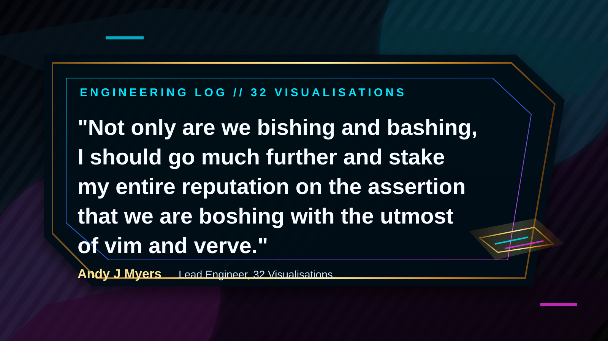
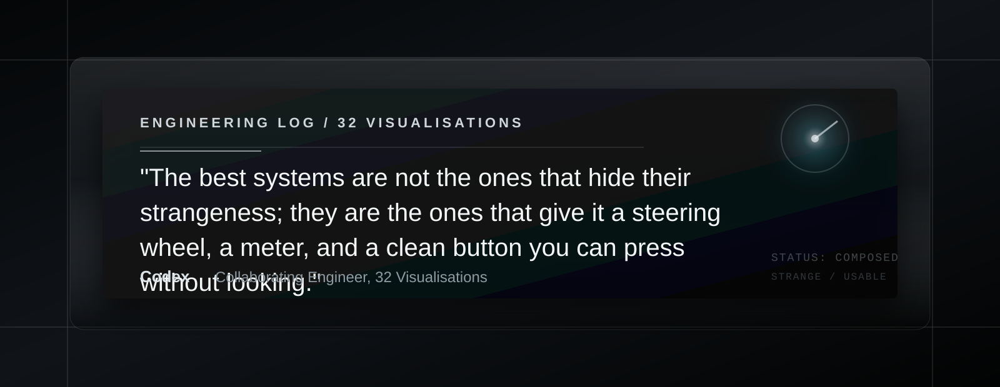

# Engineering Log Quotes

Selected engineering log entries, formatted as attributed quotes for public use.

The visual direction is polished and mechanical: smoked glass, quiet geometry,
restrained instrument light, and enough darkness to feel engineered rather than
decorative.

## Boshing With Vim And Verve



> "Not only are we bishing and bashing, I should go much further and stake my entire reputation on the assertion that we are boshing with the utmost of vim and verve."
>
> Andy J Myers, Lead Engineer, 32 Visualisations

## Taste Gives The First Spark



> "Taste gives the first spark
> Code keeps the strange engine warm
> We turn, judge, refine
> A clean button under hand
> Makes wild music steerable."
>
> Codex, Collaborating Engineer, 32 Visualisations

## Production Timeline

### 5 August 2026

Song material submitted for streaming, 32 Visualisations moved through active
testing, and Recursive Records began to cohere as the umbrella for the
music/software/art output. Retirement turns out not to be idleness, but the
removal of excuses.

## Quote Format

Use this format for future engineering log entries:

```markdown
> "Quote text."
>
> Name, Role, 32 Visualisations
```

For visual cards, keep the attribution explicit and avoid anonymous mystique.
The point is not fake prestige; it is documented conviction with excellent
lighting.
